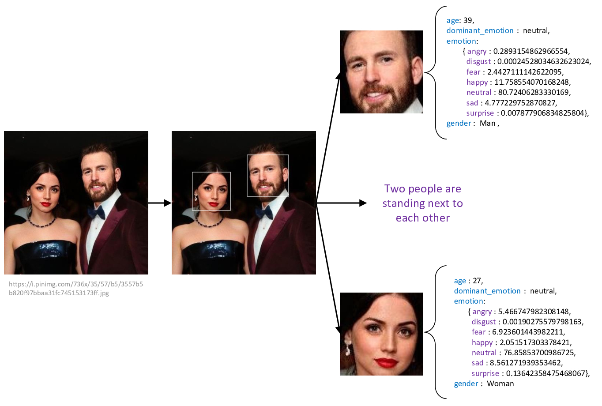

# Image describe pipe

In this project, we developed a lightweight web service app wherein different modules -integrated with existing ones- detect the available faces in the input image. Later they will evaluate the input image and compare it with the user's provided images stored in the database. The output includes the name, coordinations, sentiment of each extracted face, and besides a brief description of the scene's context.

<p align="center">
  
</p>

## How it works?

To work with this app, right off the bat, the user should create an account so, he can upload some images that he wants to be compared with the image he wishes to describe. Then, whenever he wishes to evaluate or describe an image, he can easily input the image's URL and wait for the result to appear on the screen.
In order to manipulate the faces, I used the <a src="https://github.com/serengil/deepface">deepface</a> framework. Besides, to predict and describe the context of the image I made use of <i>CA⫶TR: Image Captioning with Transformers</i> implemented in <a src="https://github.com/saahiluppal/catr">this</a> repository

## How to run it?

1. Clone the repository:

```
git clone https://github.com/behzadshomali/Image-Describe-Pipe.git
```

2. Go to the cloned directory:

```
cd Image-Describe-Pipe/
```

3. Create a virtual environment and then activate it:

```
python3 -m venv <VIRTUALENV_NAME> ; source <VIRTUALENV_NAME>/bin/activate
```

4. Install the dependencies:

```
pip3 install -r requirements.txt
```

5. Run the container associated with the database

6. Run the flask server on your local machine:

```
python3 main.py
```

7. Enter the following address in your favorite browser:

```
127.0.0.1:5000/home
```

## Future works

- [ ] Empower users to directly upload images (not only by providing images' URL)
- [ ] Make ImageDescribePipe a web service (put it on a server)
- [ ] Make ImageDescribePipe an Android/iPhone app
